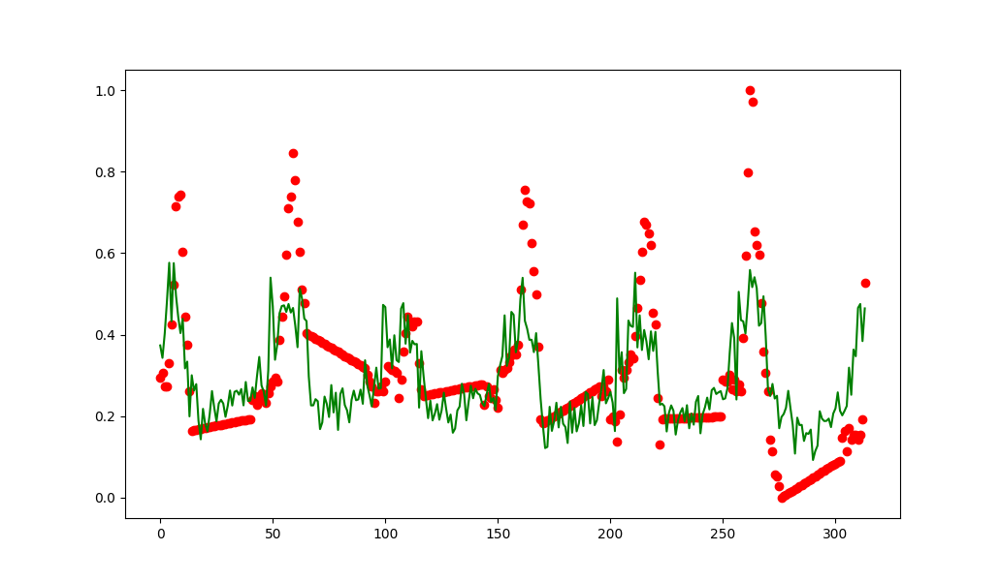

# Objetivos

## Machine Learning

Na análise com machine learning, o principal objetivo é prever a quantidade de
casos de infecções por gripe em uma região utilizando dados facilmente coletáveis. 
Desta forma, queremos criar um modelo em que seja capaz de monitorar em 
tempo real ou obter uma previsão para as próximas semanas.

O modelo estudado deve ser capaz de generalizar a predição de casos de gripe em 
diversas regiões, a fim de que seja utilizado por órgãos de saúde para direcionar 
investimentos em prevenção e vacinação nas regiões com maior probabilidade de aumento
de casos.

## Ontologias

# Metodologia

## Machine Learning

Para criar o modelo capaz de prever a quantidade de casos de influenza em uma região
exploramos diversos algoritmos de regressão com base em dados climáticos coletados 
para a cidade de Viena, Áustria, seguindo como base o artigo [1].

Além disso, iremos explorar um aprimoramento do modelo com informações de pesquisa
no Google através do Google Trends [2] filtrados para a cidade de Viena.

### Dados

Os dados climáticos coletados para a cidade de Viena são diários, nos anos de 2012 
a 2018. As features extraídas foram:
- Temperatura média, máxima e mínima;
- Umidade média;
- Temperatura e umidade medidas em horários específicos do dia (7h, 14h e 19h);
- Precipitação;
- Velocidade do vento.

Os dados coletados no Google Trends são da quantidade de pesquisas contendo a palavra "influenza" e são semanais, assim como a quantidade de casos coletados com base no órgão de saúde da Áustria.

### Pré-processamento

Como faltavam algumas informações climáticas primeiramente foi feito a interpolação
de todos os dados faltantes do dataset.

Após a interpolação, foi tratado outliers como valores de features acima de 1.8 do
desvio padrão para cada features. A seguinte função foi aplicada em cada coluna
do dataset:
```python
def out_std(s, nstd=1.8):
    data_mean, data_std = s.mean(), s.std()
    cut_off = data_std * nstd
    lower, upper = data_mean - cut_off, data_mean + cut_off

    return [False if x < lower or x > upper else True for x in s]
```
Aplicando esse filtro, os outliers passarão a ser nulos no dataset. Para corrigir
isso foi feito novamente uma interpolação nos outliers.

Como as informações de infecção por gripe são dadas semanalmente, o próximo passo
do pré-processamento é agrupar os dados climáticos por semana. Para realizar esse 
agrupamento, obtivemos a temperatura mínima e máxima de cada semana, a mediana das
temperaturas e umidades coletadas em horários específicos e a média dos demais 
valores.

Foi separado o dataset em treino e teste, sendo os dados de 2018 utilizados apenas
para teste enquanto o restante foi utilizado para treino.

Foi normalizado todas as features utilizando MinMax no intervalo [0, 1], isto é,
cada feature $X$ foi transformada em uma nova feature $X_s$ da seguinte forma:
$$
X_s := \frac{X - \min X}{\max X - \min X}
$$
Os valores $\max X$ e $\min X$ foram obtidos a partir apenas dos dados de treino,
a fim de evitar overfitting por escala. Desta forma, os dados de teste foram 
normalizados com os máximos e mínimos obtidos anteriormente.

Resumindos os passos tomados no pré-processamento:
1. Interpolação dos dados faltantes;
2. Tratamento de outliers, substituindo valores acima de $1.8$ do desvio padrão pelo valor interpolado;
3. Agregação dos dados climáticos por semana;
4. Separação dos dados de 2018 para um conjunto de teste;
5. Normalização das features utilizando min-max.

O dataset final obtido contém 12 features climáticas, 1 feature do Google Trends,
314 dados de treino (2012 a 2017) e 35 dados de teste (2018).

### Modelos

Para a regressão, separamos em dois conjuntos de treinamento. No primeiro conjunto
consideramos apenas os dados climáticos, enquanto no segundo acrescentamos o número
de pesquisas retornados pelo Google Trends.

Os modelos utilizados para regressão, através da biblioteca __scikit-learn__, foram:
- Regressão Linear;
- Random Forest Regressor, utilizando de 5 árvores;
- Multi-Layer Perceptron;
- Multi-Layer Perceptron aplicando PCA para 6 componentes.

O PCA aplicado no conjunto de treino é responsável por encontrar as features que
melhor descreve o conjunto total, diminuindo o overfitting, removendo componentes
redundantes e melhorando o desempenho dos modelos na fase de treino e inferência.

As redes neurais Multi-Layer Perceptron utilizadas possuíam 3 camadas de neurônios,
com respectivamente 256, 128 e 64 neurônios.

### Avaliação

A avaliação do modelo foi realizada utilizando o coeficiente $R^2$:
$$
SS_{res} = \sum_i (y_i - f_i)^2 \\
SS_{tot} = \sum_i (y_i - \bar{y})^2 \\
R^2 = 1 - \frac{SS_{res}}{SS_{tot}} \\
$$

Onde $y_i$ é o valor esperado (número de infecções reais) para determinado dado,
$f_i$ é o valor inferido através do modelo e $\bar{y}$ é a média de todos os 
valores esperados.

Este coeficiente é calculado apenas no conjunto de teste para avaliar os diferentes
modelos propostos. Ele foi escolhido por levar em consideração tanto a soma dos
erros quadrados ($SS_{res}$) como a variância dos dados ($SS_{tot}$). Dessa forma,
temos um valor normalizado, sendo $R^2 = 1$ o modelo perfeito, $R^2 = 0$ um modelo
que chuta um valor aleatório para todas as medidas.

## Ontologias


# Resultados e Discussão

## Machine Learning

### Dados

Segue a distribuição dos dados de treino e teste:


Nela observamos uma grande correlação positiva entre as diferentes informações de
temperatura, assim como uma alta correlação entre as informações de humidade.

Entre o número de infecções e os demais dados, observamos maior correlação positiva
com a temperatura e maior correlação negativa com a humidade.

Dessa forma, concluímos que temperatura e humidade são informações influentes para a
determinação do número de casos de influenza.

Para melhor visualizar essa relações, podemos aplicar PCA com 2 componentes e verificamos
as mesmas correlações, demonstrando que dentre todos os dados climáticos temperatura e 
humidade são os principais na determinação do número de casos:


Acrescentando os dados obtidos através do Google Trends, observamos uma alta 
correlação positiva entre o número de pesquisas no Google com o número de infecções:


### Resultados

Tabela com o coeficiente de determinação calculado no conjunto de teste
| Modelo                   | $R^2$    | $R^2$ c/ GT |
|--------------------------|----------|-------------|
|         Regressão Linear | 0.58     | 0.70        |
|            Random Forest | 0.66     | **0.78**    |
|                      MLP | 0.63     | 0.70        |
| MLP c/ PCA 6 componentes | **0.67** | 0.68        |

Percebemos, na tabela, que todos os modelos foram beneficiados com a adição do dado
do Google Trends na predição. No entanto, o modelo que melhor perfomou foi diferente
nos dois casos, sendo o MLP com PCA utilizando apenas dados climáticos e o Random Forest
com a adição do Google Trends. Além disso, o modelo Random Forest também perfomou bem
sem o Google Trends, se mostrando assim o modelo mais estável a adição de novas componentes
e tratando melhor o overfitting.

Segue os gráficos noo conjunto de treino dos melhores modelos com dados climáticos e
adicionado do Google Trends respectivamente:



Segue os gráficos dos mesmos modelos para o conjunto de teste:


Nota-se, pelos gráficos, que o modelo que utilizou o Google Trends se mostrou melhor
na inferência em dados extremos, sendo assim mais apropriado para detectar surtos.
Mesmo assim, o modelo sem o google trends também conseguiu identificar os períodos
de maior incidência de gripe, mas não com tanta exatidão.

### Aplicações

Como as informações climáticas podem ser obtidas para as próximas semanas utilizando
da previsão do tempo, o modelo que aprendeu sem o Google Trends pode ser útil na 
predição de casos de influenza nas próximas semanas, auxiliando profissionais da saúde
a direcionar campanhas de conscientização, prevenção e vacinação, além de ser possível
detectar possíveis surtos.

Já o modelo que utiliza o Google Trends pode ser utilizado para obter um acompanhamento
em tempo real dos casos de gripe com maior exatidão.

## Ontologias

# Referências

[1] https://www.kaggle.com/zikazika/predicting-sickness-with-weather-data

[2] https://trends.google.com.br/trends/?geo=BR