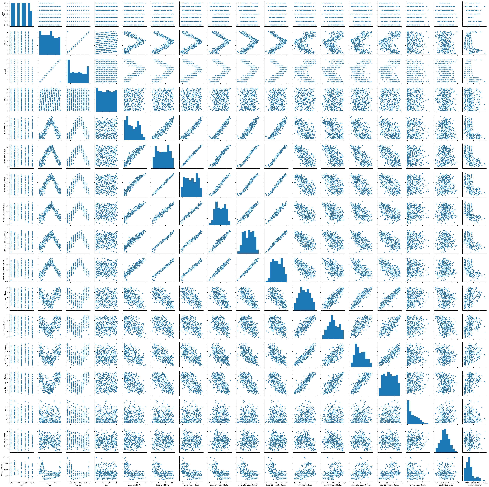
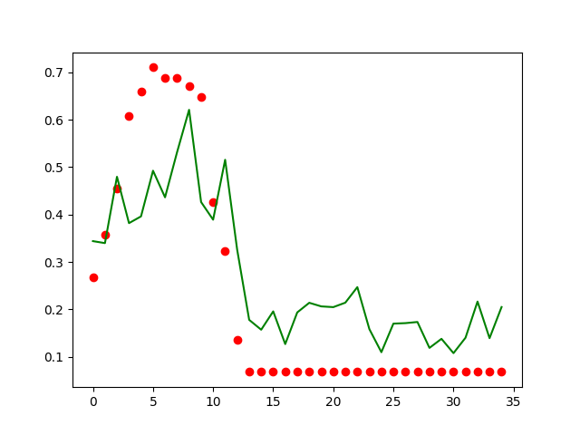

```{r, include=FALSE}
options(tinytex.verbose = TRUE)
```


# 1. Introdução

Nosso trabalho tem por objetivo pesquisar maneiras de auxiliar outras pesquisas sobre a gripe, seja trazendo novos dados, seja avaliando tipos de previsões que podemos realizar ou mesmo testando novas abordagens sobre a doença.  
Nossa abordagem de machine learning testa meios de prever os casos de gripe usando dados climáticos, entretando os modelos implementados podem ser generalizados para outros tipos de dados, como o google trends, que foi implementado, como volumetria de tweets, que, em conjunto com outras tecnicas utilizadas para filtrar e selecionar esses dados, podem aumentar a precisão de nossas previsões. Além disso nossa abordagem de redes pode encontrar tanto usuários que prejudicam os esforços de vacinação como nos casos dos grupos antivacinas, como médicos e outros profissionais da saúde que podem levar informações confiáveis ao público geral.

# 2. Objetivos  

## Machine Learning

Na análise com machine learning, o principal objetivo é prever a quantidade de
casos de infecções por gripe em uma região utilizando dados facilmente coletáveis. 
Desta forma, queremos criar um modelo em que seja capaz de monitorar em 
tempo real ou obter uma previsão para as próximas semanas.  

O modelo estudado deve ser capaz de generalizar a predição de casos de gripe em 
diversas regiões, a fim de que seja utilizado por órgãos de saúde para direcionar 
investimentos em prevenção e vacinação nas regiões com maior probabilidade de aumento
de casos.  

## Ontologias

Para a análise de ontologias, o objetivo é determinar se um texto qualquer fala
sobre influenza a partir de sintomas de doenças encontrados pelo texto.  

Para isso, será aplicado algumas técnicas de processamento de texto e realizado
consultas em ontologias que ajude a categorizar os termos encontrados no 
texto.  

## Análise de redes

  Em análise de redes tivemos dois experimentos, um com o objetivo de encontrar redes complexar envolvendo o movimento antivacinas nos Estados Unidos e encontrar os nós centrais dessas redes, o que tornaria possivel antender as motivações e argumentos utilizados e combater esse perigoso movimento.  
  O outro objetivo foi encontrar clusteres utilizando análise de redes em dados textuais, o que depois poderia ser processado para termos melhores previsões dos casos de gripe.  

## Análise Estatistica  

No campo da análise estatistica nosso trabalho teve por objetivo encontrar tópicos em mensagens sobre gripe, de maneira a identificar sintomas, falsos diagnósticos e adicionar dados que possam auxiliar em pesquisas sobre a gripe.  

# 3. Metodologia

## Machine Learning

Para criar o modelo capaz de prever a quantidade de casos de influenza em uma região
exploramos diversos algoritmos de regressão com base em dados climáticos coletados 
para a cidade de Viena, Áustria, seguindo como base o artigo [1].

Além disso, iremos explorar um aprimoramento do modelo com informações de pesquisa
no Google através do Google Trends [2] filtrados para a cidade de Viena.

### Dados

Os dados climáticos coletados para a cidade de Viena são diários, nos anos de 2012 
a 2018. As features extraídas foram:
- Temperatura média, máxima e mínima;
- Umidade média;
- Temperatura e umidade medidas em horários específicos do dia (7h, 14h e 19h);
- Precipitação;
- Velocidade do vento.

Os dados coletados no Google Trends são da quantidade de pesquisas contendo a palavra "influenza" e são semanais, assim como a quantidade de casos coletados com base no órgão de saúde da Áustria.

### Pré-processamento

Como faltavam algumas informações climáticas primeiramente foi feito a interpolação
de todos os dados faltantes do dataset.

Após a interpolação, foi tratado outliers como valores de features acima de 1.8 do
desvio padrão para cada features. A seguinte função foi aplicada em cada coluna
do dataset:
```python
def out_std(s, nstd=1.8):
    data_mean, data_std = s.mean(), s.std()
    cut_off = data_std * nstd
    lower, upper = data_mean - cut_off, data_mean + cut_off

    return [False if x < lower or x > upper else True for x in s]
```
Aplicando esse filtro, os outliers passarão a ser nulos no dataset. Para corrigir
isso foi feito novamente uma interpolação nos outliers.

Como as informações de infecção por gripe são dadas semanalmente, o próximo passo
do pré-processamento é agrupar os dados climáticos por semana. Para realizar esse 
agrupamento, obtivemos a temperatura mínima e máxima de cada semana, a mediana das
temperaturas e umidades coletadas em horários específicos e a média dos demais 
valores.

Foi separado o dataset em treino e teste, sendo os dados de 2018 utilizados apenas
para teste enquanto o restante foi utilizado para treino.

Foi normalizado todas as features utilizando MinMax no intervalo [0, 1], isto é,
cada feature $X$ foi transformada em uma nova feature $X_s$ da seguinte forma:
$$
X_s := \frac{X - \min X}{\max X - \min X}
$$
Os valores $\max X$ e $\min X$ foram obtidos a partir apenas dos dados de treino,
a fim de evitar overfitting por escala. Desta forma, os dados de teste foram 
normalizados com os máximos e mínimos obtidos anteriormente.

Resumindos os passos tomados no pré-processamento:
1. Interpolação dos dados faltantes;
2. Tratamento de outliers, substituindo valores acima de $1.8$ do desvio padrão pelo valor interpolado;
3. Agregação dos dados climáticos por semana;
4. Separação dos dados de 2018 para um conjunto de teste;
5. Normalização das features utilizando min-max.

O dataset final obtido contém 12 features climáticas, 1 feature do Google Trends,
314 dados de treino (2012 a 2017) e 35 dados de teste (2018).

### Modelos

Para a regressão, separamos em dois conjuntos de treinamento. No primeiro conjunto
consideramos apenas os dados climáticos, enquanto no segundo acrescentamos o número
de pesquisas retornados pelo Google Trends.

Os modelos utilizados para regressão, através da biblioteca __scikit-learn__, foram:
- Regressão Linear;
- Random Forest Regressor, utilizando de 5 árvores;
- Multi-Layer Perceptron;
- Multi-Layer Perceptron aplicando PCA para 6 componentes.

O PCA aplicado no conjunto de treino é responsável por encontrar as features que
melhor descreve o conjunto total, diminuindo o overfitting, removendo componentes
redundantes e melhorando o desempenho dos modelos na fase de treino e inferência.

As redes neurais Multi-Layer Perceptron utilizadas possuíam 3 camadas de neurônios,
com respectivamente 256, 128 e 64 neurônios.

### Avaliação

A avaliação do modelo foi realizada utilizando o coeficiente $R^2$:

$$
SS_{res} = \sum_i (y_i - f_i)^2 \\  
$$

$$
SS_{tot} = \sum_i (y_i - \bar{y})^2 \\  
$$   

$$   
R^2 = 1 - \frac{SS_{res}}{SS_{tot}} \\  
$$

Onde $y_i$ é o valor esperado (número de infecções reais) para determinado dado,
$f_i$ é o valor inferido através do modelo e $\bar{y}$ é a média de todos os 
valores esperados.

Este coeficiente é calculado apenas no conjunto de teste para avaliar os diferentes
modelos propostos. Ele foi escolhido por levar em consideração tanto a soma dos
erros quadrados ($SS_{res}$) como a variância dos dados ($SS_{tot}$). Dessa forma,
temos um valor normalizado, sendo $R^2 = 1$ o modelo perfeito, $R^2 = 0$ um modelo
que chuta um valor aleatório para todas as medidas.

## Ontologias

A análise de sintomas tomará como base duas ontologias:
- **Symptom Ontology (SYMP)** [3]: Ontologia com diversos
sintomas de diversas doenças categorizados;
- **Influenza Ontology (FLU)** [4]: Ontologia com informações sobre influenza, como diferentes vírus,
drogas e sintomas mais comuns.

As consultas realizadas nessas ontologias procuravam
encontrar sintomas com um termo específico, sendo
esse termo obtido através do processamento de texto.

### Processamento de Texto

Para o processamento de texto foi utilizado a biblioteca **nltk** para Python.

Dado um corpus qualquer, o primeiro passo é converter o texto em tokens, isto é, em uma lista de palavras removendo pontuação. Feito isso, será removido as **stop-words** identificados pela biblioteca.
Por fim, será aplicado **bigram** nos tokens restantes e adicionados ao fim da lista. Dessa forma, teremos uma lista com os termos principais do texto e sequências de 2 termos unidos, por exemplo:

```
The word cough itself sounds like a cough

['word', 'cough', 'sounds', 'like', 'cough', 'word cough', 'cough sounds', 'sounds like', 'like cough']
```

Com base nas consultas **SPARQL** será obtido dois subconjuntos dos tokens resultantes, onde $S$ é o
conjunto de sintomas presentes no texto e $S_I$ é o conjunto de sintomas específicos de influenza presentes no texto.

### Score de Similaridade

Para calcular a similaridade entre conjuntos foi escolhido o coeficiente de Jaccard, também conhecido como IOU (Intersection Over Union), e é definido da seguinte forma:
$$
J(A, B) = \frac{|A \cap B|}{|A \cup B|}
$$

Utilizando dessa métrica, calculamos a similaridade entre os conjuntos $S$ e $S_I$ 
e a similaridade entre os conjuntos $S_I$ e $U_I$, sendo $U_I$ o conjunto universo de todos os sintomas de influenza existentes na ontologia.

- $J(S, S_I)$: Esse score representa o quanto os sintomas presentes no texto são relacionados com a gripe. Assim, se todos os sintomas existentes no texto 
forem sintomas de gripe, o coeficiente será 1;
- $J(S_I, U_I)$: Esse score mede o quanto os sintomas de gripe existentes no texto estão próximos do conjunto
total de sintomas da ontologia **FLU**. Portanto, quanto mais
sintomas de gripe existe no texto, maior será esse score.

## Análise de redes

  Para a primeira parte da análise de redes complexas nós buscamos mensagens que continham "vaccines" e "chemicals" e identificamos seus autores, em uma pré-seleção vemos que em geral os autores se identificam como antivacinas. Utilizamos esses termos porque foi onde encontramos menos sátiras, com usuários que realmente acrediram no nesse movimento. As hashtags "#antivax" continha mais menções mas em sua maioria sátiras e ironias.  
  Então utilizamos a API do twitter para encontrar quem essas pessoas seguem, e assim montamos um grafo com 50000 perfis e suas relações. Com esse grafo, via Gephi, calculamos a centralidade dos nós e identificamos os 10 principais perfis, que consideramos os principais influenciadores dessa rede.  
  
  Na segunda parte nós utilizamos o texto de mensagens do twitter com o termo "flu" em dois periodos, 2009 - 2012, obtidos a partir da referencia 5, e de 2019. A partir desses dados fizemos seu pré-processamento textual e montamos um grafo baseado nas palavras de cada tweet. Esse grafo teve por objetivo encontrar clusteres nas mensagens e auxiliar na identificação entre casos de gripe e consiencia sobre ela, de modo a termos dados melhores para fazer a previsão dos dados futuros de gripe.  
  

## Análise Estatistica

Para a análise estatistica utilizamos os mesmos dados da segunda parte de análise de redes, o texto de mensagens do twitter com o termo "flu" em dois periodos, 2009 - 2012, obtidos a partir da referencia 6, e de 2019.  
A partir desses dados fizemos seu pré-processamento textual utilizando bibliotecas do software R.  

```
# Remove links e htmls

flu_all <- flu_all %>% mutate(text = str_replace_all(text, "&quot;|&#x2F;", "'"),    
                               text = str_replace_all(text, "&#x2F;", "/"),           
                               text = str_replace_all(text, "<a(.*?)>", " "),         
                               text = str_replace_all(text, "&gt;|&lt;", " "),        
                               text = str_replace_all(text, "<[^>]*>", " "))

prep_fun = function(x) {
  x %>% 
    # make text lower case
    str_to_lower %>% 
    # remove non-alphanumeric symbols
    str_replace_all("[^[:alpha:]]", " ") %>% 
    # collapse multiple spaces
    str_replace_all("\\s+", " ")
}


tok_fun = word_tokenizer

```

Então criamos um vocabulario onde filtramos todas as palavras que aparecem em mais de 60% dos textos, visto que em sua maioria seriam artigos e stopwords e todas as palavras que aparecem menos de 1% dos textos por serem especificas demais para podermos generalizar os tópicos.  
A partir desse vocabulario nós utilizamos Latent Dirichlet Allocation (LDA) para encontrar as palavras que definem cada tópico e o tópico que cada tweet pertence.  

# 4. Resultados e Discussão

## Machine Learning

### Dados

Segue a distribuição dos dados de treino e teste:

```{r, echo=FALSE,out.width = '50%'}

knitr::include_graphics("../images/corr.png")
```
Nela observamos uma grande correlação positiva entre as diferentes informações de
temperatura, assim como uma alta correlação entre as informações de humidade.

Entre o número de infecções e os demais dados, observamos maior correlação positiva
com a temperatura e maior correlação negativa com a humidade.

Dessa forma, concluímos que temperatura e humidade são informações influentes para a
determinação do número de casos de influenza.

Para melhor visualizar essa relações, podemos aplicar PCA com 2 componentes e verificamos
as mesmas correlações, demonstrando que dentre todos os dados climáticos temperatura e 
humidade são os principais na determinação do número de casos:

```{r, echo=FALSE,out.width = '50%'}
knitr::include_graphics("../images/pair_pca_2.png.png")
knitr::include_graphics("../images/corr_pca_2.png.png")
```


Acrescentando os dados obtidos através do Google Trends, observamos uma alta 
correlação positiva entre o número de pesquisas no Google com o número de infecções:

```{r, echo=FALSE,out.width = '50%'}
knitr::include_graphics("../images/pair_trends_crop.png")
knitr::include_graphics("../images/corr_trends.png")
```

### Resultados

Tabela com o coeficiente de determinação calculado no conjunto de teste  

| Modelo                   | $R^2$    | $R^2$ c/ GT |
|--------------------------|----------|-------------|
|         Regressão Linear | 0.58     | 0.70        |
|            Random Forest | 0.66     | **0.78**    |
|                      MLP | 0.63     | 0.70        |
| MLP c/ PCA 6 componentes | **0.67** | 0.68        |

Percebemos, na tabela, que todos os modelos foram beneficiados com a adição do dado
do Google Trends na predição. No entanto, o modelo que melhor perfomou foi diferente
nos dois casos, sendo o MLP com PCA utilizando apenas dados climáticos e o Random Forest
com a adição do Google Trends. Além disso, o modelo Random Forest também perfomou bem
sem o Google Trends, se mostrando assim o modelo mais estável a adição de novas componentes
e tratando melhor o overfitting.

Segue os gráficos no conjunto de treino dos melhores modelos com dados climáticos e
adicionado do Google Trends respectivamente:

```{r, echo=FALSE,out.width = '50%'}
knitr::include_graphics("../images/mlp_pca6_train.png")
knitr::include_graphics("../images/rf_trends_train.png")
```

Segue os gráficos dos mesmos modelos para o conjunto de teste:  

```{r, echo=FALSE,out.width = '50%'}

knitr::include_graphics("../images/rf_trends.png")
```

Nota-se, pelos gráficos, que o modelo que utilizou o Google Trends se mostrou melhor
na inferência em dados extremos, sendo assim mais apropriado para detectar surtos.
Mesmo assim, o modelo sem o google trends também conseguiu identificar os períodos
de maior incidência de gripe, mas não com tanta exatidão.

### Aplicações

Como as informações climáticas podem ser obtidas para as próximas semanas utilizando
da previsão do tempo, o modelo que aprendeu sem o Google Trends pode ser útil na 
predição de casos de influenza nas próximas semanas, auxiliando profissionais da saúde
a direcionar campanhas de conscientização, prevenção e vacinação, além de ser possível
detectar possíveis surtos.

Já o modelo que utiliza o Google Trends pode ser utilizado para obter um acompanhamento
em tempo real dos casos de gripe com maior exatidão.

## Ontologias

### Exemplo de execução do modelo

Dado um corpus $C =$ "I'm feeling sick with fever, cough,
nasal congestion and abdominal pain"

Após aplicação do pré-processamento de texto, temos
os tokens:
```python
['feeling', 'sick', 'fever', 'cough', 'nasal', 'congestion', 'abdominal', 'pain', 'feeling sick', 'sick fever', 'fever cough', 'cough nasal', 'nasal congestion', 'congestion abdominal', 'abdominal pain']
```

Após realizar as queries nas ontologias, obtemos
os dois conjuntos de sintomas:
```python
S = {'congestion', 'nasal congestion', 'abdominal pain', 'fever', 'pain', 'cough'}

S_I = {'fever', 'nasal congestion', 'cough'}
```

Calculando os dois scores de similaridade, temos:

$$
J(S, S_I) = 0.5 \\
$$  

$$  
J(S_I, U_I) = 0.375 \\
$$

### Execução do modelo no Twitter

Foi aplicado o modelo proposto em alguns posts do 
twitter de um dataset que agrega diversos tweets que 
falam sobre gripe. Os resultados:

|                                                                       Tweet                                                                      | $J(S, S_I)$ | $J(U, U_I)$ |
|:------------------------------------------------------------------------------------------------------------------------------------------------:|-------------|-------------|
| Tessa has the swine flu. Luckily not much worse than a **cough** and on/off **fever**.,Getting better!,Time feels weird. Been outta work 2 days. | 1.0         | 0.25        |
|                  's whole family is freaking out thinking that I have the swine flu.,since when is a **headache** and a **fever** the swine flu? | 1.0         | 0.25        |
|                                                             I hav a **headache** and a hard **cough** where u **cough** (not often) but wen u do | 1.0         | 0.25        |
|                                                             @GraceyJones I've been hugging her most of the day!,Motrin's just reducing **fever** | 1.0         | 0.125       |


### Aplicações

Dentre as aplicações do modelo de ontologias proposto, destacamos:
- Detecção de textos na internet que falam sobre influenza;
- Pré-processamento em análise de redes sociais (ex.: Twitter), a fim de melhorar a busca por tweets reponsáveis por gripe;
- Expansão do modelo proposto para outras doenças apenas aumentando as ontologias disponíveis.

## Análise de redes

Chegamos a um grande grafo com usuários do twitter ligados com quem eles seguem:


  
A partir disso analisamos a centralidade do grafo. Na análise das redes antivacinas americanas encontramos os 10 perfis mais centrais no grafo para estudar a fundo. Os perfis foram os seguintes:  

  

Verificamos grandes similaridades entre os utuários, com 6 deles sendo compostos por supostos grupos de médicos e cientistas que contestam à segurança das vacinas, autores de livros que associam a descoberta do autismo com campanhas de vacinação. Notamos que é muitas vezes são utilizados argumentos científicos, como pesquisas e dados, mesmo se tratando de um movimento anticiência. Um outlier desses usuários foi o Presidente dos EUA Donald Trump, que não possui postagens com conteúdo antivacinas, mas mesmo assim tem um alto grau de centralidade no grafo.  
Acreditamos que é possivel estudar esses perfis e seus argumentos para a criação de campanhas de vacinação mais eficazes e que possam atingir os membros desse grupo.  

Nossa segunda abordagem para a análise de redes teve como resultado o seguinte grafo:

   

Com isso podemos ver que há um cluster principal com as palavras relevantes sobre gripe e dois clusteres não-relacionados. Nossa pricipal hipótese era encontrar clusteres baseados nos anos que os tweets foram capturados ou em alguma das classificações baseadas na referência [6], mas apesar de não termos obtido isso podemos utilizar esse resultado para filtrar mensagens e chegar em um número de mensagens que se correlacione mais com o número real de casos de gripe, com esse número de mensagens podendo ser utilizado por pesquisadores para prever o número de casos de gripe em uma determinada região.  

## Análise Estatistica

Após encontrados os tópicos via LDA chegamos em uma distribuição bastante desigual das mensagens:
  
Assim, concluimos que topic modeling não é uma boa abordagem para o problema em questão. Entretanto tivemos resultados interessantes, com os tópicos encontrados sendo altamente correlacionados com os clusteres encontrados na segunda parte da análise de redes, mesmo eles sendo calculados por métodos bastante diferentes.  

```{r, echo=FALSE,out.width = '50%'}


```


# 5. Conclusão

No nosso trabalho foram verificadas maneiras de contribuir para a área da saúde via computação. Nós acreditamos que com mais dados nosso modelo de machine learning tende a ficar mais robusto e que nós podemos obter mais dados a partir da filtragem de posts de redes sociais, se aplicados filtros para entender melhor essas mensagens, como no caso da análise de redes e estatística.  
Além disso, nossa abordagem de ontologias, que foi bem sucedida em encontrar sintomas de gripe, pode ser extendida para um grande número de doenças e assim podemos obter dados melhores para outras pesquisas e abordagens.  
Por fim, nossa primeira abordagem na análise de redes teve sucesso em encontrar os principais influenciadores dos grupos antivacinas, a partir disso podemos definir abordagens para combater esse tipo de discurso.

# 6. Referencias

[1] https://www.kaggle.com/zikazika/predicting-sickness-with-weather-data

[2] https://trends.google.com.br/trends/?geo=BR

[3] http://symptomontologywiki.igs.umaryland.edu/mediawiki/index.php/Main_Page

[4] http://influenzaontologywiki.igs.umaryland.edu/mediawiki/index.php/Main_Page

[5] Lamb, Alex and Paul, Michael J. and Dredze, Mark, Separating Fact from Fear: Tracking Flu Infections on Twitter, June 2013.
